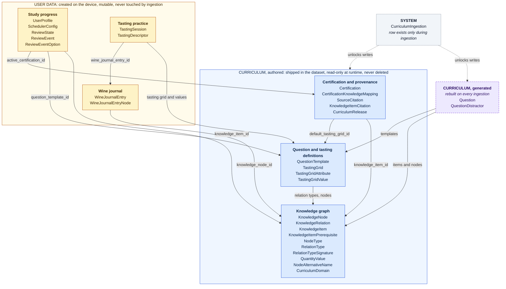
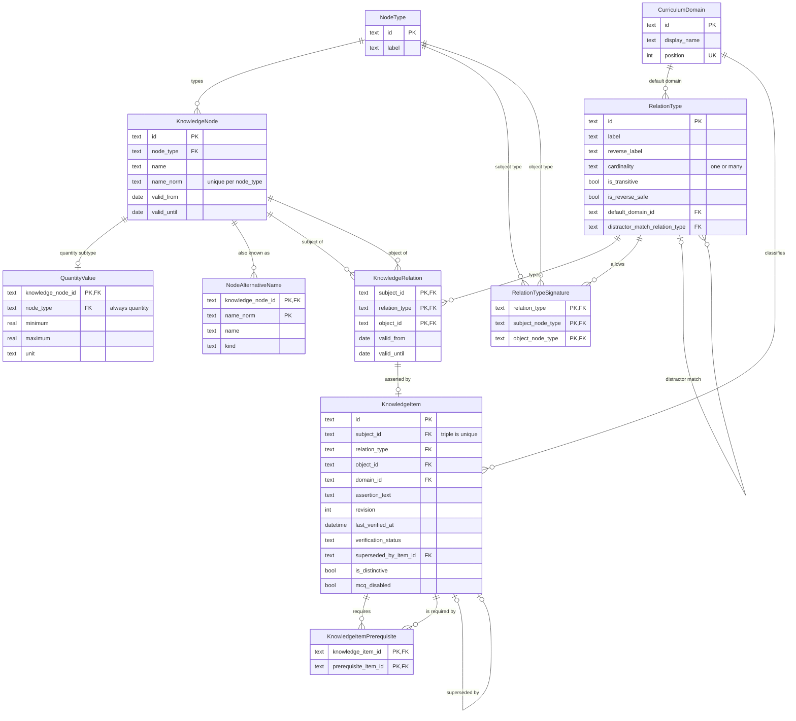
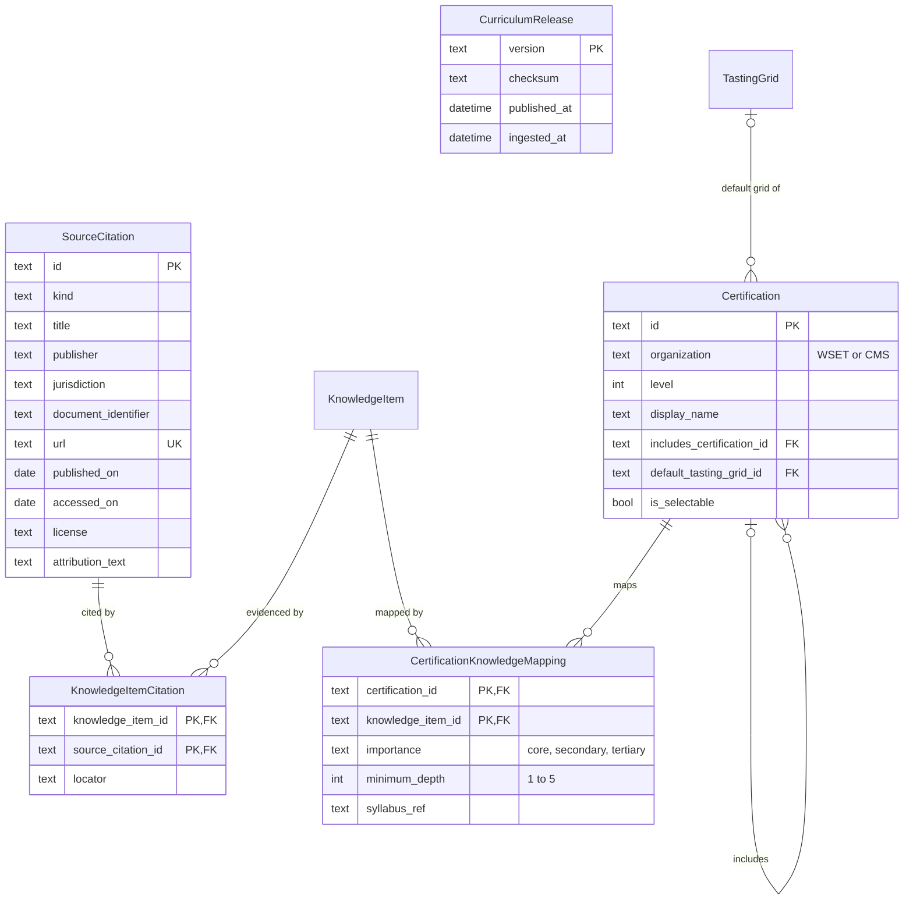
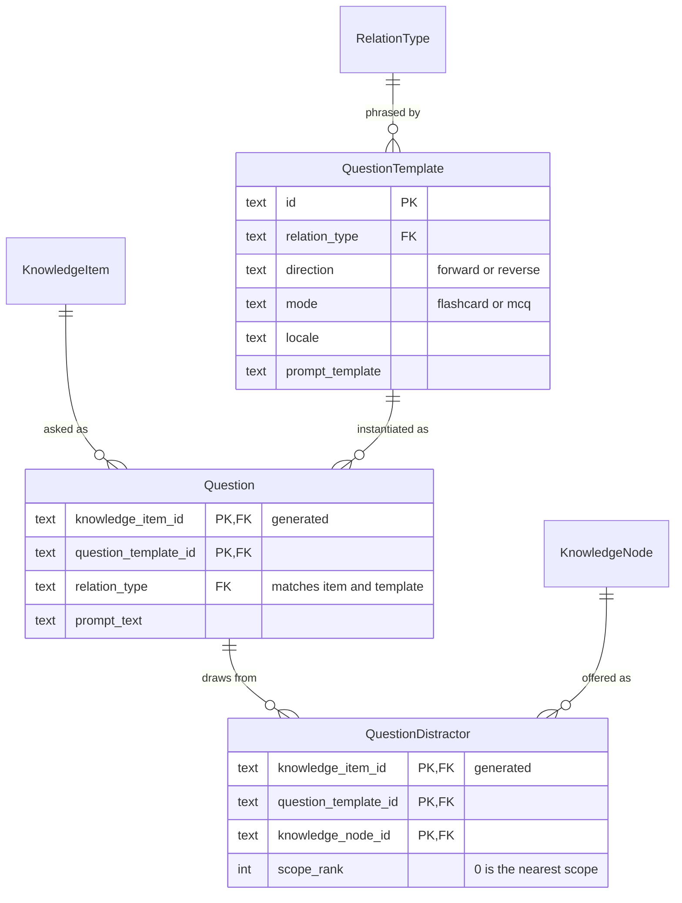
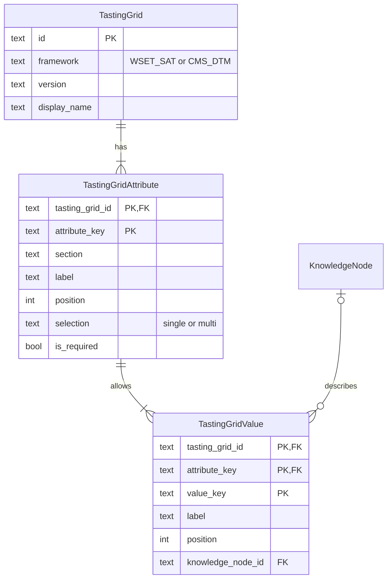
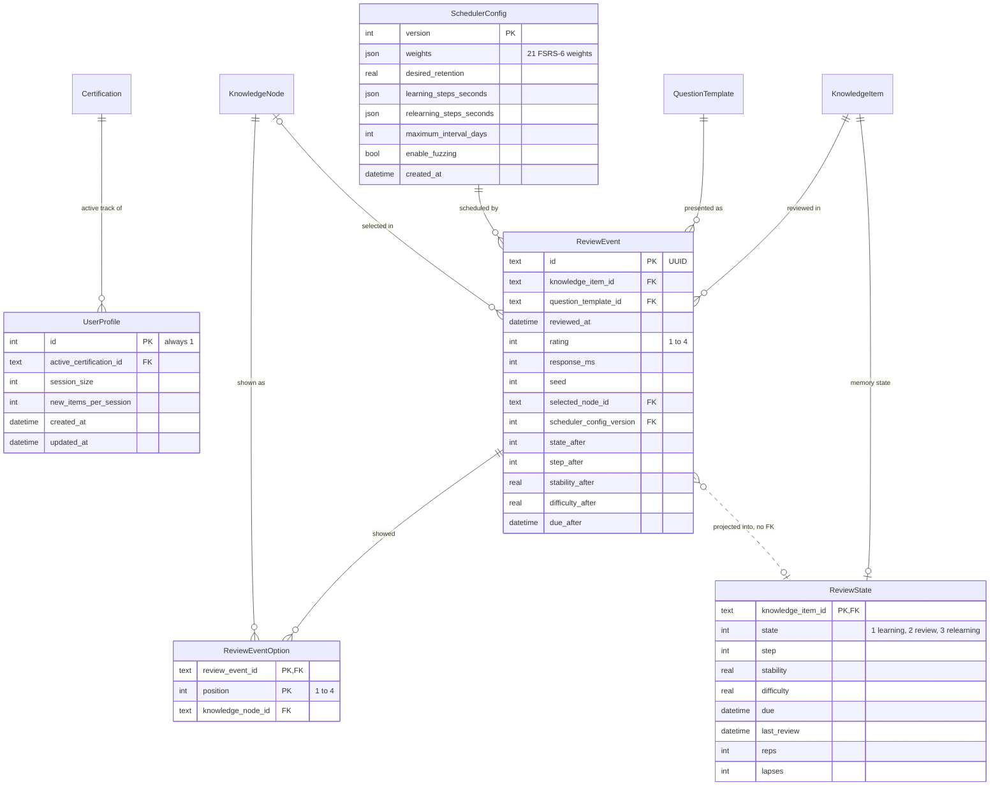
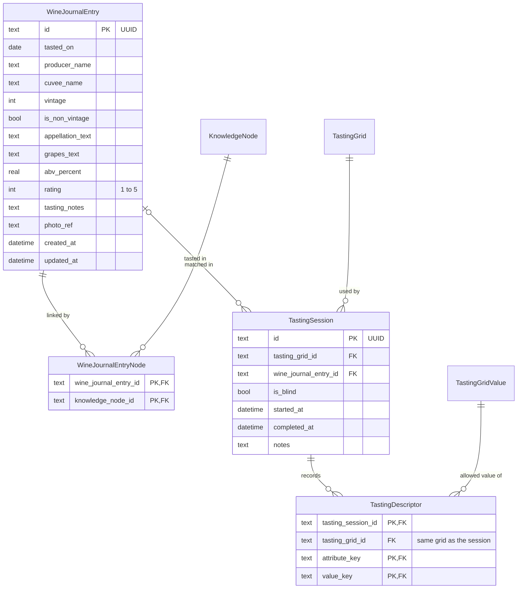

# Canonical Domain Model — Sommelier Study App (schema v1)

| | |
|---|---|
| **Date** | 2026-09-24 |
| **Status** | **Canonical.** Where earlier documents name or shape an entity differently, this document wins. [architecture-audit.md](architecture-audit.md) has been aligned with it. |
| **Executable form** | [`lib/core/database/schema.drift`](../lib/core/database/schema.drift): 31 tables, 57 indexes, 68 triggers. The app compiles it with Drift, and it is also valid plain SQLite (§9). |
| **Scope** | Every entity V0.1 needs, including the 14 required ones: Certification, CurriculumDomain, KnowledgeNode, KnowledgeRelation, KnowledgeItem, CertificationKnowledgeMapping, SourceCitation, QuestionTemplate, Question, ReviewState, ReviewEvent, TastingSession, TastingDescriptor, WineJournalEntry |

## 1. How to read this document

- **Names.** An entity is singular PascalCase (`KnowledgeRelation`); its table is plural snake_case (`knowledge_relations`). Drift generates row classes with exactly these entity names from the SQL, so the Dart API uses the same vocabulary.
- **Types.** The diagrams use these type names:

  | Type | Meaning |
  |---|---|
  | `text`, `int`, `real` | SQLite storage types |
  | `bool` | 0 or 1 |
  | `date` | `YYYY-MM-DD` text |
  | `datetime` | a UTC instant as ISO-8601 text with milliseconds (`2026-03-04T05:06:07.890Z`) |
  | `json` | a JSON array, used only for FSRS parameter vectors |

- **Keys.** `PK` primary key, `FK` foreign key, `UK` unique. A composite key marks each of its columns.
- **IDs.** Curriculum IDs are stable and opaque, with a prefix per entity: `n_` nodes, `ki_` items, `src_` citations, `qt_` templates, `tg_` tasting grids. Certification IDs are track codes such as `WSET_L3`. Rows created on the device use UUIDs.

---

## 2. Data classes: immutable curriculum vs mutable user data

Every table belongs to exactly one class.

| | **Curriculum, authored** | **Curriculum, generated** | **User data** | **System** |
|---|---|---|---|---|
| **Entities** | Certification, CurriculumDomain, KnowledgeNode, KnowledgeRelation, KnowledgeItem, CertificationKnowledgeMapping, SourceCitation, QuestionTemplate, plus the 11 supporting entities in §4.2 | Question, QuestionDistractor | ReviewState, ReviewEvent, TastingSession, TastingDescriptor, WineJournalEntry, UserProfile, SchedulerConfig, ReviewEventOption, WineJournalEntryNode | CurriculumIngestion |
| **Origin** | Written by curators; shipped in the dataset | Derived from authored rows by the question generator | Created by the learner on the device | Written by the ingestion service |
| **When written** | Only inside an ingestion transaction | Only inside an ingestion transaction | Any time | During ingestion only |
| **At runtime** | **Read-only** | **Read-only** | Read-write | — |
| **Deletion** | **Never.** Retired with `valid_until` or `superseded_by_item_id` | Rebuilt wholesale on every ingestion | By the user (journal, tasting). The review log is append-only | Row removed when ingestion ends |
| **May reference** | Curriculum only | Authored curriculum | Curriculum and user data | — |
| **Referenced by** | Everything | Nothing outside the generated tables | User data only | — |
| **Backup and future sync** | No; reinstalled from the app bundle | No; regenerated | **Yes**, together with the release version | No |

**Rules**, and how each is enforced:

1. **The curriculum is read-only at runtime.** Every curriculum table has `BEFORE INSERT/UPDATE/DELETE` triggers that abort unless a `curriculum_ingestions` row exists. The ingestion service inserts that row at the start of its transaction and deletes it before committing, so a crash rolls back to "locked".
   - Proven: writes are rejected outside ingestion, and the same statements succeed inside it.
   - Proven: a failed ingestion rolls back and leaves the curriculum locked.
   - The triggers fire per row, so a statement that matches no rows is a no-op, not an error.
2. **References point one way:** user → curriculum, and generated → authored. No curriculum table has a foreign key to user data. Diagram 3.1 shows this: every foreign-key arrow that crosses a class boundary points into the authored curriculum. The dotted arrows are the ingestion lock, not references.
3. **Authored rows are never deleted.** Ingestion only upserts. The validator fails a release in which a previously shipped row is missing.
4. **Generated rows can be rebuilt freely**, because no user table references them. User history references the item and the template, which are authored and permanent (proven).
5. **Ingestion never writes user tables**, and user tables hold all personal state. Backup, export and future sync (§N) therefore cover exactly the user tables, plus the curriculum release version needed to interpret them.

---

## 3. Diagrams

Each ER diagram details the entities of **one** data class. An empty box (no attributes) is a reference to an entity detailed in another diagram. Relationships use crow's-foot notation, and the dashed line in 3.6 is a derivation, not a foreign key.

### 3.1 Overview

The arrows are foreign-key references, drawn from the referencing group to the referenced group.



### 3.2 Curriculum (authored): knowledge graph



### 3.3 Curriculum (authored): certification and provenance



### 3.4 Curriculum: question templates (authored) and questions (generated)

`Question` and `QuestionDistractor` are generated. The other boxes are authored.



### 3.5 Curriculum (authored): tasting grids



### 3.6 User data: study progress



### 3.7 User data: tasting practice and wine journal



---

## 4. Entity catalogue

Column-level definitions are in [`schema.drift`](../lib/core/database/schema.drift). This section explains each entity: why it exists, its key, and the rules that are not obvious from its columns.

### 4.1 Required entities

#### Certification (`certifications`), curriculum

A study track, the "lens" of §C through which the one canonical graph is studied.

- **Key:** `id` (a track code, e.g. `WSET_L3`); `UNIQUE(organization, level)`.
- `includes_certification_id` makes tracks **cumulative**: L3 → L2 → L1, and Certified → Introductory. The nearest mapping along the chain applies (architecture audit CM-3).
- `default_tasting_grid_id` selects the tasting engine for the track, SAT or DTM. This is §I's "the interface reconfigures based on the active certification profile", expressed as data.
- `is_selectable` limits the V0.1 profile picker to `WSET_L3` and `CMS_CERTIFIED`.
- **Database-enforced:** a track cannot include itself.
- **Validator:** chains are acyclic and stay within one organization.
- Exam-simulator configuration (§D) is not modelled; simulators are deferred (§N).

#### CurriculumDomain (`curriculum_domains`), curriculum

The six silos of §D: geography, viticulture, winemaking, service, business and tasting. They are used for analytics, focused sessions, and as a relation type's default domain.

#### KnowledgeNode (`knowledge_nodes`), curriculum

Any single concept (§D): a country, region, appellation, grape, soil, climate, hazard, berry colour, structural or aromatic descriptor, or a quantity.

- **Key:** `id` (`n_…`); `UNIQUE(node_type, name_norm)`.
  - `name_norm` is the matching key: lower case, with diacritics and appellation suffixes removed. It is computed in Dart during ingestion, because SQLite folds case for ASCII only.
  - The uniqueness constraint rejects near-duplicates such as "Rhône" and "Rhone" within a type.
- **Characteristics are nodes, not attribute columns.** For example, Syrah `HAS_BERRY_COLOUR` Black. This follows §C's "physiological, structural and aromatic nodes". It also makes every characteristic value FK-checked, and keeps a single traversal mechanism: distractor filters such as "other black grapes" (§H) are ordinary relation lookups.
- `valid_from` and `valid_until` record the legal existence of the concept, e.g. an abolished appellation. A renamed appellation keeps its ID; its old name becomes a `NodeAlternativeName` of kind `former_name`.
- Literal values live in the `QuantityValue` subtype (§4.2).

#### KnowledgeRelation (`knowledge_relations`), curriculum

The graph edge of §C and §D: *subject* `relation_type` *object*, for example Chablis `PERMITS_PRINCIPAL_GRAPE` Chardonnay. This is the spec's KnowledgeRelation, which TASK-001 and §S call "KnowledgeEdge".

- **Key:** the natural triple (`subject_id`, `relation_type`, `object_id`). It is stable because node IDs are stable, so no surrogate ID is needed.
- **Legal validity lives here** (`valid_from` required, `valid_until` nullable). Traversal, distractor pools and answer sets all operate on relations, so an expired fact stops affecting them even when no item asserts it.
- An index on (`object_id`, `relation_type`) serves reverse traversal.
- **Database-enforced:** subject ≠ object; `valid_until > valid_from`.
- **Validator:** subject and object types match a `RelationTypeSignature`; a `cardinality = one` relation has no overlapping validity for the same subject; `LOCATED_IN` is acyclic.

#### KnowledgeItem (`knowledge_items`), curriculum

The atomic unit of study: the testable assertion of **exactly one** relation.

- **Key:** `id` (`ki_…`). The triple is `UNIQUE` and is a composite FK to `KnowledgeRelation`, so an item cannot assert a relation that does not exist (proven).
- **One item per relation**, so every question about a fact updates that fact's memory state (§F). Relations with no item are structural, e.g. `LOCATED_IN` used only for traversal.
- `assertion_text` is the explanation shown after answering. Questions are generated from the triple, not from this text.
- Curation fields: `revision`, `last_verified_at`, `verification_status` and `superseded_by_item_id`.
- Question-generation flags:
  - `is_distinctive`: the object identifies the subject, so reverse recall is safe.
  - `mcq_disabled`: a curator override.

#### CertificationKnowledgeMapping (`certification_knowledge_mappings`), curriculum

Which items a track examines, how important each is, and to what depth. This normalizes §E's nested `certifications[]` array.

- **Key:** (`certification_id`, `knowledge_item_id`).
- `importance` (core, secondary or tertiary) drives the relevance factor. `minimum_depth` (1–5) controls which question formats the track serves (architecture audit P-2, adopted).
- `syllabus_ref` holds a structural identifier only, **never syllabus text** (§L).

#### SourceCitation (`source_citations`), curriculum

Evidence for facts, from public primary sources: legislation, regulator registers, government publications, academic work, reference works and datasets (§D, §L). Items link to citations through `KnowledgeItemCitation`, whose `locator` records the article, section or page. This normalizes §E's `source_citation_ids`.

- Citations carrying a `license` and `attribution_text` feed a generated attributions screen.
- **Validator:** every item has at least one citation. Regulatory relations need a legislation or regulator-register citation.

#### QuestionTemplate (`question_templates`), curriculum

A deterministic structure for generating practice material (§D, §H).

- **Key:** `id` (`qt_…`); `UNIQUE(relation_type, direction, mode, locale)`.
- `direction` (forward or reverse) and `mode` (flashcard or MCQ) are independent axes. Placeholders are `{subject.name}`, `{object.name}` and `{object.type_label}`. The locale is English only in V0.1.

#### Question (`questions`), curriculum, generated

A servable question: "a materialized instance of a template applied to a specific KnowledgeItem, ready to be served" (§D). There is exactly one row per eligible (item, template) pair.

- **Key:** (`knowledge_item_id`, `question_template_id`).
- `relation_type` is duplicated here so that two composite FKs can guarantee the template belongs to the item's relation type (proven). `prompt_text` is rendered at generation time.
- The answer node is **derived, not stored**: the item's object for a forward question, its subject for a reverse one.
- **Eligibility**, decided at generation:
  - a template exists for the item's relation;
  - for MCQ, at least 3 valid distractors exist;
  - for reverse, the relation is reverse-safe or the item is distinctive;
  - the item is not `mcq_disabled`.

  An existing MCQ `Question` row *is* §S.3's "flagged for multiple choice".
- `QuestionDistractor` holds the pool of valid wrong answers, where `scope_rank` 0 is the nearest geographic scope. Each presentation draws 3 with a logged seed; what was actually shown is recorded in `ReviewEventOption`.
- **Distractor exclusion ignores validity dates.** Anything that is, was, or will be a correct answer is never offered as a wrong one.

#### ReviewState (`review_states`), user

The current FSRS-6 memory state of one item (§D, §F).

- **Key:** `knowledge_item_id`. **No row means New.** Retrievability is never stored; it depends on the current time.
- **Database-enforced:**
  - Review state (2) has no `step`; Learning (1) and Relearning (3) have one.
  - `lapses < reps`.
  - `due > last_review`.
  - Stability > 0 and difficulty between 1 and 10.
- **A projection of the review log.** It equals the latest `ReviewEvent`'s after-state plus the review and lapse counts, is written in the same transaction as the event, and can be rebuilt from the log. This was proven with a real four-review FSRS sequence.

#### ReviewEvent (`review_events`), user, append-only

The log of §D: "the user's grade, the elapsed time, and the resulting changes to the ReviewState".

- **Key:** `id` (UUID).
- Records what was asked (`knowledge_item_id`, `question_template_id`), how it was answered (`rating`, `response_ms`, `selected_node_id`), the `seed`, the `scheduler_config_version`, and the **after-state**.
- The after-state is stored because, with fuzzing, `due_after` is random. It cannot be recomputed by replay, so it is information rather than derived data.
- **Derived, not stored:** direction and mode (from the template); the before-state (the previous event, via a window function); elapsed days; correctness (the selected option vs the answer).
- **Append-only:** `UPDATE` and `DELETE` abort, on both `review_events` and `review_event_options`. A future "reset progress" feature would need an explicit, audited mechanism.

#### TastingSession (`tasting_sessions`), user

The metadata of one practical tasting (§D, §I).

- **Key:** `id` (UUID); `UNIQUE(id, tasting_grid_id)` is the target of the descriptor FK.
- `tasting_grid_id` fixes the framework and its version. The optional `wine_journal_entry_id` links the bottle tasted; it is set to NULL if that journal entry is deleted.

#### TastingDescriptor (`tasting_descriptors`), user

One sensory observation, e.g. sweetness = dry.

- **Key:** (`tasting_session_id`, `attribute_key`, `value_key`).
- **Database-enforced**, proven on native and Web:
  - Values must come from the **session's own grid**: a composite FK through (`tasting_session_id`, `tasting_grid_id`). This makes TASK-008's "only WSET terminology in SAT mode" a database guarantee.
  - A `single` attribute accepts one value; a trigger enforces it.

#### WineJournalEntry (`wine_journal_entries`), user

A logged bottle (§D, §J).

- **Key:** `id` (UUID).
- The raw text the user typed (`appellation_text`, `grapes_text`) is kept. Links to canonical nodes are stored separately in `WineJournalEntryNode`, and their role (appellation, grape…) is derived from the node's type.
- `photo_ref` is an opaque key for a future photo store, not a file path. There is no capture UI in V0.1 (D6).
- **Database-enforced:** non-vintage excludes a vintage; ranges for vintage, ABV and rating (rating 1–5, P-3).

### 4.2 Supporting entities

| Entity (table) | Class | Why it exists |
|---|---|---|
| CurriculumRelease (`curriculum_releases`) | curriculum, written by ingestion | Dataset version (semver), checksum, and publish and ingest times per release |
| NodeType (`node_types`) | curriculum | Closed vocabulary of node types; `label` feeds `{object.type_label}` |
| RelationType (`relation_types`) | curriculum | The relation vocabulary: cardinality, transitivity, reverse safety, default domain, and the relation used to filter distractors (e.g. berry colour) |
| RelationTypeSignature (`relation_type_signatures`) | curriculum | The allowed subject and object node types per relation (checked by the validator) |
| QuantityValue (`quantity_values`) | curriculum | Subtype of KnowledgeNode for literal facts: `minimum`, `maximum` and `unit`. A composite FK admits only nodes of type `quantity` (proven) |
| NodeAlternativeName (`node_alternative_names`) | curriculum | Synonyms (Shiraz/Syrah), former names, abbreviations and spelling variants, for matching journal text |
| KnowledgeItemPrerequisite (`knowledge_item_prerequisites`) | curriculum | The prerequisite DAG (§E `prerequisite_item_ids`). A self-reference is blocked by a CHECK; longer cycles are caught by the validator |
| KnowledgeItemCitation (`knowledge_item_citations`) | curriculum | Links an item to its evidence, with a `locator` |
| TastingGrid (`tasting_grids`) | curriculum | A versioned tasting framework (`WSET_SAT` or `CMS_DTM`) |
| TastingGridAttribute (`tasting_grid_attributes`) | curriculum | One field of a grid: section, order, and single or multiple selection |
| TastingGridValue (`tasting_grid_values`) | curriculum | One allowed value, with an optional link to an aroma or structure node |
| QuestionDistractor (`question_distractors`) | curriculum, generated | The pool of valid wrong answers for an MCQ question |
| UserProfile (`user_profiles`) | user | A single row (`id = 1`): the active track and session settings (P-4) |
| SchedulerConfig (`scheduler_configs`) | user | Versioned FSRS parameters. Exactly 21 weights, checked by JSON CHECKs |
| ReviewEventOption (`review_event_options`) | user, append-only | The options shown in an MCQ presentation, in display order |
| WineJournalEntryNode (`wine_journal_entry_nodes`) | user | Links a journal entry to its matched nodes; deleted with the entry |
| CurriculumIngestion (`curriculum_ingestions`) | system | The curriculum write lock (§2, rule 1) |

---

## 5. Normalization

Every table has a primary key: natural keys where they are stable (junction tables, the relation triple), opaque stable IDs for curriculum entities, and UUIDs for user rows. Non-key columns depend on the whole key and nothing else, **with six deliberate exceptions**. Each has a stated reason and an invariant that keeps it consistent:

| Exception | Reason | Invariant and how it is kept |
|---|---|---|
| `ReviewState` duplicates information in `ReviewEvent` | The study queue needs current state indexed by `due`, not a replay of the whole log | It equals the latest event's after-state plus counts, is written in the same transaction, and can be rebuilt (proven) |
| `Question` and `QuestionDistractor` are derived | §D names Question as materialized. It turns §S.3 into a `COUNT`, and keeps recursive traversal out of runtime queries (which matters on Web) | Rebuilt wholesale by every ingestion; nothing references them |
| `Question.relation_type` and `TastingDescriptor.tasting_grid_id` repeat a parent's key | They let composite FKs enforce rules that span tables (template matches item; value from the session's grid) | The composite FKs themselves reject any inconsistent value |
| `name_norm` on nodes and alternative names | A search key derived from `name`. It cannot be a SQL expression, because SQLite case folding is ASCII-only | Computed by the ingestion tooling; the validator recomputes and compares |
| JSON arrays in `SchedulerConfig` | An opaque parameter vector that the FSRS package consumes as a whole; no query ever reads a single weight | `CHECK`: valid JSON array, exactly 21 weights |
| Raw text in `WineJournalEntry` | The user's original input. The node links are an interpretation of it, not a copy | Not derived, so nothing to keep in sync |

**What earlier drafts had and this model removes, to reach normal form:**

- node attribute JSON (replaced by characteristic nodes and `QuantityValue`)
- the journal-link `role` (derivable from the node's type)
- direction and mode on review events (derivable from the template)
- the before-state on review events (derivable from the previous event)
- the answer node on questions (derivable from the item and the direction)

---

## 6. Where each integrity rule lives

**Database constraints and triggers.** Every rule in this group is proven on native SQLite 3.53.4 and in Chromium.

- The curriculum is read-only outside ingestion.
- Foreign keys, including the composite ones:
  - item → relation
  - question → template and item, with a matching relation type
  - descriptor → the session's own grid values
  - quantity value → a node of type `quantity`
- Uniqueness:
  - a normalized name within a node type
  - the relation triple
  - one item per relation
  - one template per relation, direction, mode and locale
  - grid positions
- Formats:
  - `date` columns (`date(x) IS x`)
  - `datetime` columns (exactly `YYYY-MM-DDTHH:MM:SS.sssZ`, UTC with milliseconds)
  - UUIDs and ID prefixes
- Ranges and enumerations.
- The review-state invariants (step coupling, `lapses < reps`, `due > last_review`).
- The review log is append-only.
- Single-selection tasting attributes.
- The shape of the FSRS parameter vector.

**Ingestion validator** (build time and at ingestion), for rules that span rows or releases:

- Relation subject and object types match a `RelationTypeSignature`.
- Prerequisites, `LOCATED_IN` and certification chains are acyclic, and certification chains stay within one organization.
- `cardinality = one` relations have no overlapping validity for the same subject.
- Every item has at least one citation and at least one track mapping. Regulatory relations have a legislation or register citation.
- Every MCQ question has at least 3 distractors, and no distractor is a correct answer in any validity period.
- No authored row disappears between releases.
- `name_norm` recomputes identically.

**Application services:**

- A review writes the event and the projection in one transaction, and counts lapses.
- Timestamps come from an injected clock, in UTC, truncated to milliseconds.
- Native Dart `DateTime` values carry microseconds and Web values cannot. Truncating makes both platforms identical, and the timestamp CHECK rejects anything else (proven).
- Ingestion sets and clears the write lock inside a single transaction.

**Timestamps compare as text.** Drift's comparison operators (`isSmallerOrEqual`…) compare text-stored timestamps as strings. The fixed-width UTC format therefore makes text order equal time order. That is what lets the study-queue query (`due <= now`) use the `review_states_by_due` index. The CHECK constraints themselves use `unixepoch(…, 'subsec')`.

---

## 7. Dataset format

The authored tables *are* the dataset format. Each YAML section is named after its table, and each key is a column name, so there is no mapping layer. Generated tables, user tables and `name_norm` never appear in the dataset; the tooling produces them.

How the spec's §Q seed maps onto the canonical format:

| §Q seed | Canonical dataset |
|---|---|
| `version: "1.0"` | `dataset_version` (semver), stored in `curriculum_releases.version` |
| `nodes[].type` | `knowledge_nodes[].node_type` |
| `edges[]` with `subject` / `relation` / `object` | `knowledge_relations[]` with `subject_id` / `relation_type` / `object_id`, plus `valid_from` / `valid_until` |
| `relation: PERMITS_GRAPE` | `relation_type: PERMITS_PRINCIPAL_GRAPE`, the §D and §E name |
| `knowledge_items[].domain` | `domain_id` |
| `subject_ref` / `edge_ref` / `object_ref` | `subject_id` / `relation_type` / `object_id` |
| `assertion` | `assertion_text` |
| nested `certifications[]` with `track`, `importance` | the top-level `certification_knowledge_mappings[]`, with `certification_id`, `importance` and the required `minimum_depth` |
| no provenance or versioning | the relation's validity; the item's `last_verified_at`, `verification_status` and `revision`; `source_citations[]` and `knowledge_item_citations[]` |

A slice of the §Q seed in canonical form. The values in angle brackets are placeholders that curators fill from the cited source (D3); no legal identifier is invented here.

```yaml
dataset_version: "0.1.0"

relation_types:
  - id: PERMITS_PRINCIPAL_GRAPE
    label: permits the principal grape
    reverse_label: is a principal grape of
    cardinality: many
    is_transitive: false
    is_reverse_safe: false
    default_domain_id: geography
    distractor_match_relation_type: HAS_BERRY_COLOUR

knowledge_nodes:
  - { id: n_geo_burgundy,     node_type: region,      name: Burgundy }
  - { id: n_geo_chablis,      node_type: appellation, name: Chablis }
  - { id: n_grape_chardonnay, node_type: grape,       name: Chardonnay }

knowledge_relations:
  - subject_id: n_geo_chablis
    relation_type: PERMITS_PRINCIPAL_GRAPE
    object_id: n_grape_chardonnay
    valid_from: <effective date of the cited text>
    valid_until: null

knowledge_items:
  - id: ki_chablis_grape
    subject_id: n_geo_chablis
    relation_type: PERMITS_PRINCIPAL_GRAPE
    object_id: n_grape_chardonnay
    domain_id: geography
    assertion_text: Chardonnay is the only permitted principal grape variety in the Chablis AOC.
    last_verified_at: <UTC timestamp of the curator's check>
    verification_status: unverified

certification_knowledge_mappings:
  - { certification_id: WSET_L2,       knowledge_item_id: ki_chablis_grape, importance: core, minimum_depth: 1 }
  - { certification_id: CMS_CERTIFIED, knowledge_item_id: ki_chablis_grape, importance: core, minimum_depth: 2 }

source_citations:
  - id: src_inao_chablis
    kind: legislation
    title: Cahier des charges de l'appellation d'origine contrôlée « Chablis »
    publisher: INAO
    jurisdiction: FR
    document_identifier: <decree or publication reference>
    url: <official URL>
    accessed_on: <date checked>

knowledge_item_citations:
  - { knowledge_item_id: ki_chablis_grape, source_citation_id: src_inao_chablis, locator: <article> }
```

---

## 8. Changes to earlier decisions

Normalizing the model revised the following. [architecture-audit.md](architecture-audit.md) is updated to match. The Phase 0 audit and the architecture validation keep their original text, with a note pointing here.

| Before | Now | Reason |
|---|---|---|
| `knowledge_edges` / KnowledgeEdge; type column `relation` | `knowledge_relations` / **KnowledgeRelation**; type column `relation_type`, referencing `RelationType` | The spec's own domain model (§D) and schema (§E) use these names; KnowledgeEdge appears only in the backlog and tests |
| `item_certifications` | **CertificationKnowledgeMapping** | The canonical entity list |
| `journal_entries`, `journal_entry_nodes` with `role` | **WineJournalEntry**, **WineJournalEntryNode**, no `role` | Entity list; `role` is derivable from the node's type |
| `attributes_json` on nodes, with a `json_valid` CHECK | Characteristic **nodes** and the **QuantityValue** subtype | Normal form; values become FK-checked; §C models characteristics as nodes |
| `node_aliases` | **NodeAlternativeName** with a `kind`, plus `KnowledgeNode.name_norm` | Synonyms and former names are domain concepts; near-duplicate names are rejected |
| Questions not stored (SI-9, QG-9) | **Question** and **QuestionDistractor** stored as *generated* curriculum | §D defines Question as materialized; §S.3 becomes a query; no runtime recursion; history is unaffected |
| Review events store direction, mode and before/after snapshots | They store the **after-state** only | Direction, mode and before-state are derivable. The after-state is not, because of fuzzing |
| Curriculum immutability by convention | **Write-guard triggers** plus the `CurriculumIngestion` lock | A database guarantee, proven |
| Timestamps "UTC ISO text" | A **fixed millisecond UTC format**, enforced by CHECK | Text order must equal time order; native and Web precision differ |
| — | Distractor exclusion ignores validity dates | Never offer a past or future correct answer as a wrong one |
| `user_profile`, `curriculum_ingestion` (singular) | `user_profiles`, `curriculum_ingestions` | Consistently plural tables. Drift then generates `UserProfile` and `CurriculumIngestion` without Drift-only syntax |

---

## 9. Verification

Everything below was run on 2026-09-24 against Flutter 3.47.5 / Dart 3.13.4.

- **Plain SQLite:** `schema.drift` loads as-is: 31 tables, 57 indexes, 68 triggers (63 curriculum guards, 4 append-only, 1 single-selection).
- **Drift:** the same file compiles as a `.drift` file with drift_dev 2.35.0 and **zero warnings**, using `sql: {dialect: sqlite, options: {version: "3.45", modules: [json1]}}` and `store_date_time_values_as_text: true`. The 31 generated row classes carry exactly the entity names of this document.
- **Native behaviour** (SQLite 3.53.4 through Drift), 18 tests, all passing:
  - the curriculum rejects writes outside ingestion
  - control: the same writes succeed inside ingestion
  - a failed ingestion rolls back and stays locked
  - the seed loads through ingestion
  - item → relation FK
  - quantity subtype FK
  - template/item relation match
  - unique normalized names
  - canonical dates
  - generated questions rebuild without touching history
  - user data is writable while the curriculum is locked
  - UTC millisecond timestamps (microsecond and local-time values rejected)
  - review-state invariants
  - append-only log
  - tasting lexicon isolation and single selection
  - journal rules
  - 21-weight scheduler configuration
  - an FSRS review sequence whose projection equals a replay of the log
- **Web:** the same schema, opened through Drift's WASM backend in headless Chromium (SQLite 3.53.4), with and without COOP/COEP headers. All 14 checks gave the same result as native:

  | Expected | Checks |
  |---|---|
  | Rejected | writes outside ingestion; quantity on a grape; malformed date; template mismatch; local-time timestamp; `due` not after `last_review`; second value for a single attribute; DTM term in a SAT session; 20 weights; deleting an event; updating an event |
  | Accepted | seeded ingestion; UTC timestamp; a SAT term in a SAT session |

- **Diagrams:** all seven render with Mermaid 11.17.2 (light and dark themes) and Mermaid 10.9.8.

**In the app:** Phase 0 moved this schema to `lib/core/database/schema.drift` unchanged, and the app's `AppDatabase` is generated from it (SQL-first). The documented schema and the code are one file. The Phase 0 test suite re-runs the behaviour tests above against the app database, plus a CRUD test for every table.
